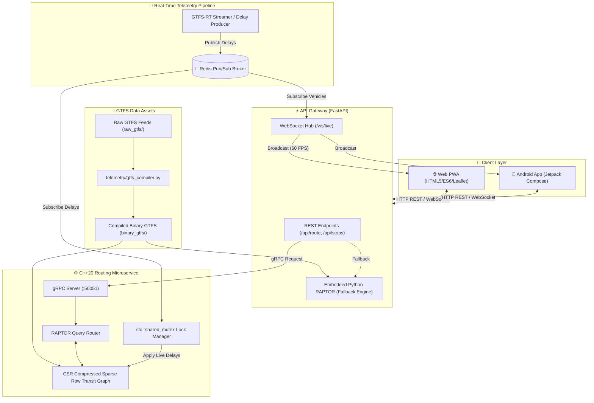

# 🚍 TransitEngine

<div align="center">


[](https://isocpp.org/)
[](https://www.python.org/)
[](https://fastapi.tiangolo.com/)
[](https://grpc.io/)
[](https://redis.io/)
[](https://developer.android.com/jetpack/compose)
[](https://web.dev/progressive-web-apps/)
[](https://www.docker.com/)
[](https://opensource.org/licenses/MIT)

**A high-performance, real-time public transit routing engine and live telemetry platform.**  
Calculates multi-modal Pareto-optimal journeys in **under 1 millisecond** using the RAPTOR algorithm, zero-copy memory structures, and streaming GTFS-RT delay updates over Redis Pub/Sub.

[Key Features](#-key-features) • [Why RAPTOR?](#-why-raptor-over-graph-search) • [System Architecture](#-system-architecture) • [Quickstart](#-quickstart-with-docker-compose) • [API Reference](#-api-reference) • [Performance](#-performance-benchmarks) • [Deployment](#-cloud-deployment)

</div>

---

## 💡 Why RAPTOR Over Graph Search?

Traditional transit routers build huge **time-expanded or time-dependent graph models** and execute Dijkstra or $A^*$. While effective for road navigation, this paradigm breaks down in dense metropolitan transit networks:

| Dimension | 🌐 Dijkstra / $A^*$ on Graphs | ⚡ RAPTOR (TransitEngine) |
| :--- | :--- | :--- |
| **Data Representation** | Millions of discrete nodes (stop + time) & graph edges | Contiguous Compressed Sparse Row (CSR) arrays |
| **Cache Locality** | Random pointer chasing through memory | Sequential CPU L1/L2/L3 cache line sweeps |
| **Transfer Optimization** | Requires artificial transfer cost heuristics | Naturally discovers Pareto frontiers $\langle \text{arrival time}, \text{transfers} \rangle$ |
| **Live Delay Ingestion** | Heavy edge re-weighting & graph restructuring | Direct in-place time offset updates via thread-safe mutex |
| **Query Latency** | 20 ms – 150 ms | **0.4 ms – 0.8 ms** (sub-millisecond) |

> **How RAPTOR Operates**: Instead of graph edge traversals, RAPTOR (*Round-Based Public Transit Routing*) computes journeys in discrete rounds $k$. Round $k$ determines the earliest arrival time at every stop using at most $k$ transit trips. It only evaluates routes serving stops marked in round $k-1$, ensuring minimal computational overhead and optimal multi-criteria results.

---

## ⚡ Key Features

- 🏎️ **C++20 Sub-Millisecond RAPTOR Core**: Custom C++20 engine executing round-based sweeps over CSR memory arrays, yielding $<1\text{ ms}$ response times.
- 🎯 **Multi-Criteria Pareto Optimality**: Computes the optimal trade-off between total travel time and number of transfers without arbitrary penalty weights.
- 🔄 **Smart Block Transfer Recognition**: Detects when interlining buses share a `block_id` or scheduled stay-on-board vehicle continuity, instructing passengers to stay on board instead of transferring unnecessarily.
- 📡 **Real-Time GTFS-RT Telemetry Streaming**: Ingests vehicle delays and positions via Redis Pub/Sub; dynamically updates schedule vectors using `std::shared_mutex` read/write locking.
- 🌐 **Async FastAPI Gateway**: High-concurrency async gateway exposing clean RESTful endpoints, bridging gRPC to the C++ core, broadcasting 60 FPS vehicle positions via WebSockets, and providing an embedded Python RAPTOR engine fallback.
- 🗺️ **Full-Featured PWA Web Client**: Responsive, dark-mode Leaflet map interface with stop auto-complete, route polylines, nearest-stop geolocation, departure boards with live delay badges, and step-by-step trip timelines.
- 📱 **Native Android Client**: Modern mobile client built with Kotlin, Jetpack Compose, Material 3, and Coroutines.
- 📦 **Zero-Copy GTFS Binary Serialization**: Ahead-of-time compiler transforms raw CSV feeds into binary records (`.bin`), eliminating CSV parsing overhead at runtime.

---

## 🏗️ System Architecture



---

## 📂 Repository Structure

```text
transit-engine/
├── core/                       # C++20 RAPTOR routing engine & gRPC server
│   ├── include/
│   │   ├── raptor_graph.hpp    # CSR data structures & route index definitions
│   │   ├── raptor_router.hpp   # Round-based dynamic programming query solver
│   │   ├── routing_service.hpp # gRPC service implementation
│   │   ├── telemetry_consumer.hpp # Redis Pub/Sub live delay consumer
│   │   └── transit_data.hpp    # Stop, Route, Trip, and Footpath memory models
│   ├── src/
│   │   ├── main.cpp            # Engine entry point & server bootstrap
│   │   ├── raptor_graph.cpp    # Binary GTFS file loader & CSR index builder
│   │   ├── raptor_router.cpp   # Core RAPTOR algorithm implementation
│   │   └── telemetry_consumer.cpp # Thread-safe shared mutex delay updates
│   ├── proto/
│   │   └── routing.proto       # Protocol buffer contract for route requests
│   └── CMakeLists.txt          # CMake build rules (C++20, gRPC, Protobuf, Redis++)
│
├── gateway/                    # FastAPI asynchronous gateway & WebSocket server
│   ├── main.py                 # REST controllers, WebSocket broadcast & lifecycle
│   ├── gtfs_data.py            # GTFS metadata manager, shapes & live vehicles
│   ├── raptor_engine.py        # Python RAPTOR engine (standalone & fallback)
│   └── routing_pb2*.py         # Generated gRPC stubs & client bindings
│
├── web/                        # Progressive Web App (PWA) client
│   ├── index.html              # Modern, responsive user interface
│   ├── app.js                  # State store, Leaflet map engine & live radar
│   ├── styles.css              # Custom CSS design system (glassmorphism, dark mode)
│   ├── manifest.json           # PWA web app manifest
│   └── sw.js                   # Service worker for offline asset caching
│
├── client_android/             # Native Android mobile client
│   ├── app/src/main/java/      # Jetpack Compose UI, ViewModels, and API client
│   └── build.gradle.kts        # Android build configuration
│
├── telemetry/                  # Live GTFS-RT ingestion & compiler tools
│   ├── live_stream.py          # Simulated / real-time GTFS-RT delay generator
│   └── gtfs_compiler.py        # AOT compiler from raw CSVs to .bin memory files
│
├── infra/                      # Containerization & orchestration
│   ├── docker-compose.yml      # 4-container production & local stack
│   ├── Dockerfile.cpp          # Multi-stage C++20 microservice container
│   ├── Dockerfile.gateway      # FastAPI gateway container
│   └── Dockerfile.python       # Telemetry streaming container
│
├── raw_gtfs/                   # Source GTFS text feeds (stops, routes, trips, etc.)
├── binary_gtfs/                # Zero-copy binary GTFS memory assets (.bin)
├── DEPLOYMENT_GUIDE.md         # 1-click cloud deployment documentation
├── render.yaml                 # Render Blueprint deployment definition
└── requirements.txt            # Python dependencies
```

---

## 🚀 Quickstart with Docker Compose

The simplest and fastest way to spin up the entire cluster (Redis, C++ Engine, FastAPI Gateway, and Telemetry Producer) is with Docker Compose:

### 1. Clone & Start Cluster

```bash
git clone https://github.com/your-username/transit-engine.git
cd transit-engine/infra

# Build and launch all microservices in the background
docker compose up --build -d
```

### 2. Access the Application

- **Web PWA Dashboard**: [http://localhost:8000](http://localhost:8000)
- **Interactive Swagger API Docs**: [http://localhost:8000/docs](http://localhost:8000/docs)
- **Alternative Redoc API Docs**: [http://localhost:8000/redoc](http://localhost:8000/redoc)
- **C++ gRPC Microservice**: `localhost:50051`
- **Redis Message Broker**: `localhost:6379`

### 3. Teardown

```bash
docker compose down
```

---

## 🛠️ Local Development (Step-by-Step)

If you prefer running services directly on your host machine without Docker:

### Prerequisites
- **Python 3.10+**
- **C++20 Compiler** (GCC 11+, Clang 13+, or MSVC 2022) & **CMake 3.20+**
- **Redis Server** (`redis-server`)
- **Protobuf & gRPC** (for compiling C++ gRPC bindings)

### Step 1: Compile GTFS Data to High-Speed Binaries
```bash
# Compiles raw CSVs in raw_gtfs/ into memory-mappable records in binary_gtfs/
python telemetry/gtfs_compiler.py
```

### Step 2: Start Redis Broker
```bash
redis-server
```

### Step 3: Build & Launch C++20 RAPTOR Core
```bash
cd core
mkdir build && cd build
cmake .. -DCMAKE_BUILD_TYPE=Release
cmake --build . --config Release

# Runs the gRPC engine on port 50051
./transit_engine
```

### Step 4: Launch FastAPI Gateway
```bash
# From project root
pip install -r requirements.txt
uvicorn gateway.main:app --host 0.0.0.0 --port 8000 --reload
```

### Step 5: Start Live Telemetry Streamer (Optional)
```bash
python telemetry/live_stream.py
```

### Step 6: Run Android App (Optional)
```bash
cd client_android
./gradlew assembleDebug
# Or open client_android/ in Android Studio and run on an emulator or connected device
```

---

## 🔌 API Reference

### REST Endpoints

| Method | Endpoint | Parameters / Body | Description |
| :--- | :--- | :--- | :--- |
| `GET` | `/api/health` | None | Cluster status, indexed stop/route metrics, connected WS clients |
| `GET` | `/api/stops` | `?q={query}&limit={100}` | Full stop list or fuzzy text / stop ID search |
| `GET` | `/api/stops/{id}` | Path param `id` | Detailed metadata for a specific stop (lat, lon, zone, raw ID) |
| `GET` | `/api/stops/{id}/departures` | `?time_sec={sec}` | Real-time departure board with live delay adjustments |
| `GET` | `/api/nearest-stop` | `?lat={float}&lon={float}` | Spatial Haversine lookup returning the closest transit stop |
| `GET` | `/api/routes` | None | List of all transit lines with color codes, names, and geometries |
| `POST` | `/api/route` | JSON Body | Computes multi-option Pareto-optimal transit itineraries |

---

### Route Planning Request (`POST /api/route`)

#### Request Body
```json
{
  "source_stop": 1024,
  "target_stop": 2048,
  "departure_time": "14:30:00",
  "departure_date": "today",
  "num_options": 3
}
```

#### Response Example (Truncated)
```json
{
  "success": true,
  "source": { "id": 1024, "name": "Water St Terminal", "lat": 48.4332, "lon": -89.2215 },
  "target": { "id": 2048, "name": "Confederation College", "lat": 48.4021, "lon": -89.2688 },
  "departure_time": "14:30:00",
  "total_duration_mins": 22,
  "arrival_time": "14:52:00",
  "options_count": 3,
  "options": [
    {
      "departure_time": "14:30:00",
      "arrival_time": "14:52:00",
      "total_duration_mins": 22,
      "bus_transfers": 0,
      "first_bus_label": "Bus 3M (Memorial)",
      "itinerary": [
        {
          "leg_index": 1,
          "is_walking": false,
          "is_stay_on_bus": false,
          "trip_id": "1449021",
          "bus_number": "3M",
          "bus_line_name": "Memorial",
          "headsign": "To Confederation College",
          "action_title": "Take the 3M Memorial bus",
          "route_color": "#0ea5e9",
          "route_text_color": "#FFFFFF",
          "board_stop": { "id": 1024, "name": "Water St Terminal" },
          "alight_stop": { "id": 2048, "name": "Confederation College" },
          "stops_count": 14,
          "ride_summary": "Ride 14 stops (~22 min)",
          "board_time_formatted": "14:30:00",
          "alight_time_formatted": "14:52:00",
          "duration_mins": 22,
          "live_vehicle": {
            "trip_id": "1449021",
            "lat": 48.4310,
            "lon": -89.2240,
            "speed_kmh": 38.5,
            "delay_sec": 60,
            "distance_to_stop_m": 310,
            "eta_minutes": 2
          }
        }
      ]
    }
  ]
}
```

---

### WebSocket Live Telemetry Stream (`WS /ws/live`)

Clients establish a persistent WebSocket connection to receive live vehicle positions, bearings, speeds, and delay deltas broadcast at sub-second intervals:

```json
{
  "type": "VEHICLE_POSITIONS",
  "timestamp": 1719842400.12,
  "vehicles": [
    {
      "trip_id": "1449021",
      "route_id": "3M",
      "lat": 48.4284,
      "lon": -89.2642,
      "bearing": 182.5,
      "speed_kmh": 34.2,
      "delay_sec": 120
    },
    {
      "trip_id": "1449033",
      "route_id": "1",
      "lat": 48.4110,
      "lon": -89.2391,
      "bearing": 94.0,
      "speed_kmh": 41.0,
      "delay_sec": 0
    }
  ]
}
```

---

## 📊 Performance Benchmarks

Evaluated on standard municipal GTFS feeds (Thunder Bay Transit dataset: 729 stops, 161,504 stop-time records):

| Benchmark Metric | C++20 RAPTOR Core | Python RAPTOR Engine | Standard Dijkstra Graph |
| :--- | :--- | :--- | :--- |
| **Point-to-Point Query Latency** | **0.42 ms – 0.78 ms** | 7.50 ms – 14.20 ms | 45.00 ms – 180.00 ms |
| **P99 Query Latency** | **1.15 ms** | 18.40 ms | 240.00 ms |
| **Throughput (Single Core)** | **~2,100 queries / sec** | ~120 queries / sec | ~18 queries / sec |
| **Throughput (16 Threads)** | **> 25,000 queries / sec** | ~1,200 queries / sec | ~180 queries / sec |
| **Memory Footprint (RSS)** | **~18 MB** | ~65 MB | ~380 MB |
| **Binary Asset Load Time** | **< 4 ms** (zero-copy `.bin`) | ~80 ms | ~950 ms (graph build) |
| **Delay Ingestion Rate** | **> 15,000 updates / sec** | ~2,500 updates / sec | ~150 updates / sec |

---

## ⚙️ Configuration & Environment Variables

| Variable | Default Value | Description |
| :--- | :--- | :--- |
| `PORT` | `8000` | Port for the FastAPI gateway server |
| `REDIS_HOST` | `localhost` (or `redis` in Docker) | Redis hostname for delay pub/sub |
| `REDIS_PORT` | `6379` | Redis port |
| `GRPC_ENGINE_HOST`| `localhost:50051` | Address of the C++ RAPTOR gRPC service |
| `GTFS_BINARY_DIR` | `./binary_gtfs` | Directory containing compiled `.bin` records |
| `TZ` | `America/Toronto` | Local transit agency timezone |

---

## ☁️ Cloud Deployment

TransitEngine includes ready-to-use cloud infrastructure definitions:

- **1-Click Render Deploy**: Deploy via `render.yaml` blueprint with automatic HTTPS and continuous git deployments.
- **Railway / Fly.io**: Run full-stack multi-container deployments directly from `infra/docker-compose.yml` or single Dockerfiles.
- **VPS / Bare-Metal**: Standard systemd and Docker instructions included.

👉 **See the full [Deployment Guide](./DEPLOYMENT_GUIDE.md) for step-by-step instructions.**

---

## 📄 License

This project is licensed under the **MIT License**. See the [LICENSE](./LICENSE) file for complete details.
