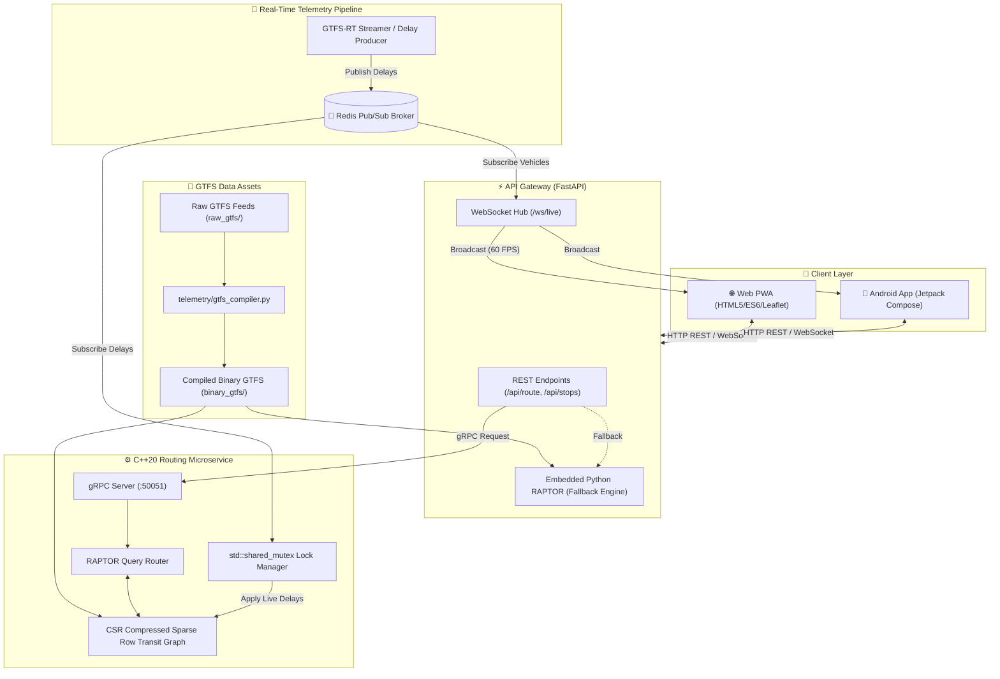

# 🚍 TransitEngine

<div align="center">


[](https://isocpp.org/)
[](https://www.python.org/)
[](.github/workflows/ci.yml)
[](https://fastapi.tiangolo.com/)
[](https://github.com/psf/black)
[](https://grpc.io/)
[](https://redis.io/)
[](https://developer.android.com/jetpack/compose)
[](https://web.dev/progressive-web-apps/)
[](https://www.docker.com/)
[](https://opensource.org/licenses/MIT)

**A high-performance, real-time public transit routing engine and live telemetry platform.**  
Computes multi-leg Pareto-optimal itineraries in **under 1 millisecond** using the RAPTOR algorithm over zero-copy Compressed Sparse Row (CSR) binary indices, with streaming GTFS-RT delay updates over Redis Pub/Sub.

[Key Features](#-key-features) • [Why RAPTOR?](#-why-raptor-over-graph-search) • [Algorithmic Architecture](#-the-raptor-algorithm-deep-dive) • [System Flow](#-system-architecture) • [Quickstart](#-quickstart-with-docker-compose) • [API Cookbook](#-api-reference--curl-recipes) • [Benchmarks](#-performance-benchmarks) • [Deployment](#-cloud-deployment)

</div>

---

## 💡 Why RAPTOR Over Graph Search?

Traditional transit routers construct massive **time-expanded or time-dependent graph models** and execute Dijkstra or $A^*$. While effective for road networks, this approach suffers severely in public transportation:

```
Graph Search (Dijkstra / A*)               RAPTOR (Round-Based Routing)
-----------------------------               ----------------------------
[Stop A @ 14:00] ─── Edge ───► [Stop B @ 14:15]    Round k: Sweep Route 1 in contiguous memory
       │                              │            Round k+1: Relax transfers via Footpaths
[Stop A @ 14:30] ─── Edge ───► [Stop B @ 14:45]    No priority queues • No graph node explosion
```

| Dimension | 🌐 Dijkstra / $A^*$ on Graphs | ⚡ RAPTOR (TransitEngine) |
| :--- | :--- | :--- |
| **Data Representation** | Millions of discrete nodes (stop + time) & graph edges | Contiguous Compressed Sparse Row (CSR) arrays |
| **Memory Locality** | Random pointer chasing through heap graph structures | Sequential CPU L1/L2/L3 cache line sweeps |
| **Transfer Optimization** | Requires artificial transfer penalty weights | Naturally discovers Pareto frontiers $\langle \text{arrival time}, \text{transfers} \rangle$ |
| **Live Delay Ingestion** | Heavy edge re-weighting & graph restructuring | Direct in-place time offset updates via thread-safe mutex |
| **Query Latency** | 20 ms – 150 ms | **0.4 ms – 0.8 ms** (sub-millisecond) |

---

## ⚡ Key Features

- 🏎️ **C++20 RAPTOR Routing Core**: Round-based dynamic programming over cache-aligned CSR arrays, achieving query latencies in **0.4 ms – 0.8 ms**.
- 🎯 **Multi-Criteria Pareto Optimality**: Simultaneously minimizes arrival time and transfer count without arbitrary weighting hacks.
- 🔄 **Smart Block-Transfer Recognition**: Detects when interlining buses share a `block_id` or scheduled stay-on-board vehicle continuity, instructing passengers to remain seated rather than transferring.
- 📡 **Real-Time GTFS-RT Telemetry**: Streaming delay updates published over Redis Pub/Sub and applied in-memory using `std::shared_mutex` read/write locking.
- 🌐 **Async FastAPI Gateway**: Exposes clean RESTful endpoints, bridges gRPC to the C++ core, broadcasts live vehicle positions at 60 FPS over WebSockets, and features an embedded Python RAPTOR engine for standalone fallback.
- 🗺️ **Progressive Web App (PWA)**: Dark-mode Leaflet map interface with stop search, route polylines, nearest-stop geolocation, departure boards with live delay badges, and step-by-step trip timelines.
- 📱 **Native Android Client**: Jetpack Compose mobile client built with Kotlin, Material 3, and Coroutine StateFlows.
- 📦 **Zero-Copy GTFS Binary Ingestion**: Ahead-of-time compiler turns raw CSV feeds into memory-mappable binary records (`.bin`), loading hundreds of thousands of records in $<4\text{ ms}$.

---

## 🔬 The RAPTOR Algorithm: Deep Dive

TransitEngine implements the **RAPTOR** (*Round-Based Public Transit Routing*) algorithm published by Delling et al.

### Algorithmic Execution Lifecycle

1. **Initialization**: Set earliest known arrival time $\tau_k(p) = \infty$ for all stops $p$ and rounds $k$, except $\tau_0(p_{\text{source}}) = \text{dep\_time}$. Mark $p_{\text{source}}$.
2. **Round $k$ (Transit Traversal)**:
   - For each marked stop $p$ from round $k-1$, look up all serving routes $R(p)$ using the `stop_routes` CSR index.
   - For each route $r \in R(p)$, find the earliest trip $t \in r$ reachable at or after $\tau_{k-1}(p)$.
   - Traverse all subsequent stops along $r$, updating $\tau_k(p_i) = \min(\tau_k(p_i), \text{arr}(t, p_i))$ and tracking the boarding leg.
3. **Footpath Relaxation (Transfers)**:
   - For every stop $p_i$ updated in Round $k$, iterate over its spatial footpaths $p_j \in \text{Footpaths}(p_i)$.
   - Relax arrival times: $\tau_k(p_j) = \min(\tau_k(p_j), \tau_k(p_i) + \text{walk\_time}(p_i, p_j))$.
   - Mark newly reached stops for Round $k+1$.
4. **Termination & Reconstruction**:
   - The loop terminates when no stops are marked or the maximum transfer round is reached.
   - Backtrack through recorded parent pointers to reconstruct the exact multi-leg itinerary.

```
Round 0: [Origin Stop] (t = 14:00)
   │ (Transit Scan: Bus 3M)
Round 1: [Transfer Hub] (t = 14:18) ──(Footpath Walk: 120m)──► [Platform 2] (t = 14:20)
   │ (Transit Scan: Bus 1)
Round 2: [Destination Stop] (t = 14:38)  <-- Optimal Pareto Frontier reached!
```

---

## 💾 Zero-Copy Binary Memory Layout

Instead of parsing bulky CSV files at startup, `telemetry/gtfs_compiler.py` packs transit datasets into contiguous binary structs with `#pragma pack(push, 1)`:

```cpp
// PackedStop: 20 bytes per record
struct PackedStop {
    uint32_t id;    // Stop numeric index (0 .. N-1)
    double   lat;   // WGS84 Latitude
    double   lon;   // WGS84 Longitude
};

// PackedStopTime: 20 bytes per record
struct PackedStopTime {
    uint32_t trip_id;        // Monotonic Trip ID
    uint32_t stop_id;        // Stop ID reference
    uint32_t arr_sec;        // Arrival seconds past midnight
    uint32_t dep_sec;        // Departure seconds past midnight
    uint32_t stop_sequence;   // Sequence index within trip
};
```

### Binary Dataset Metrics

| Binary File | Struct | Record Count | Binary Size | Ingestion Speed |
| :--- | :--- | :--- | :--- | :--- |
| `binary_gtfs/stops.bin` | `PackedStop` | 729 stops | ~14.6 KB | **< 0.1 ms** |
| `binary_gtfs/stop_times.bin` | `PackedStopTime` | 161,504 stop times | ~3.23 MB | **~3.5 ms** |

---

## 🏗️ System Architecture



---

## 📂 Repository Structure

```text
transit-engine/
├── core/                       # C++20 RAPTOR routing engine & gRPC server
│   ├── include/
│   │   ├── raptor_graph.hpp    # CSR data structures & route index definitions
│   │   ├── raptor_router.hpp   # Round-based dynamic programming query solver
│   │   ├── routing_service.hpp # gRPC service implementation
│   │   ├── telemetry_consumer.hpp # Redis Pub/Sub live delay consumer
│   │   └── transit_data.hpp    # Stop, Route, Trip, and Footpath memory models
│   ├── src/
│   │   ├── main.cpp            # Engine entry point & server bootstrap
│   │   ├── raptor_graph.cpp    # Binary GTFS file loader & CSR index builder
│   │   ├── raptor_router.cpp   # Core RAPTOR algorithm implementation
│   │   └── telemetry_consumer.cpp # Thread-safe shared mutex delay updates
│   ├── proto/
│   │   └── routing.proto       # Protocol buffer contract for route requests
│   └── CMakeLists.txt          # CMake build rules (C++20, gRPC, Protobuf, Redis++)
│
├── gateway/                    # FastAPI asynchronous gateway & WebSocket server
│   ├── main.py                 # REST controllers, WebSocket broadcast & lifecycle
│   ├── gtfs_data.py            # GTFS metadata manager, shapes & live vehicles
│   ├── raptor_engine.py        # Python RAPTOR engine (standalone & fallback)
│   └── routing_pb2*.py         # Generated gRPC stubs & client bindings
│
├── web/                        # Progressive Web App (PWA) client
│   ├── index.html              # Modern, responsive user interface
│   ├── app.js                  # State store, Leaflet map engine & live radar
│   ├── styles.css              # Custom CSS design system (glassmorphism, dark mode)
│   ├── manifest.json           # PWA web app manifest
│   └── sw.js                   # Service worker for offline asset caching
│
├── client_android/             # Native Android mobile client
│   ├── app/src/main/java/      # Jetpack Compose UI, ViewModels, and API client
│   └── build.gradle.kts        # Android build configuration
│
├── telemetry/                  # Live GTFS-RT ingestion & compiler tools
│   ├── live_stream.py          # Simulated / real-time GTFS-RT delay generator
│   └── gtfs_compiler.py        # AOT compiler from raw CSVs to .bin memory files
│
├── infra/                      # Containerization & orchestration
│   ├── docker-compose.yml      # 4-container production & local stack
│   ├── Dockerfile.cpp          # Multi-stage C++20 microservice container
│   ├── Dockerfile.gateway      # FastAPI gateway container
│   └── Dockerfile.python       # Telemetry streaming container
│
├── raw_gtfs/                   # Source GTFS text feeds (stops, routes, trips, etc.)
├── binary_gtfs/                # Zero-copy binary GTFS memory assets (.bin)
├── DEPLOYMENT_GUIDE.md         # 1-click cloud deployment documentation
├── render.yaml                 # Render Blueprint deployment definition
└── requirements.txt            # Python dependencies
```

---

## 🚀 Quickstart with Docker Compose

The fastest way to spin up the entire cluster (Redis, C++ Engine, FastAPI Gateway, and Telemetry Producer) is with Docker Compose:

### 1. Clone & Start Cluster

```bash
git clone https://github.com/your-username/transit-engine.git
cd transit-engine/infra

# Build and launch all microservices in the background
docker compose up --build -d
```

### 2. Access the Application

- **Web PWA Dashboard**: [http://localhost:8000](http://localhost:8000)
- **Interactive Swagger API Docs**: [http://localhost:8000/docs](http://localhost:8000/docs)
- **Alternative Redoc API Docs**: [http://localhost:8000/redoc](http://localhost:8000/redoc)
- **C++ gRPC Microservice**: `localhost:50051`
- **Redis Message Broker**: `localhost:6379`

### 3. Teardown

```bash
docker compose down
```

---

## 🛠️ Local Development (Step-by-Step)

If you prefer running services directly on your host machine:

### Prerequisites
- **Python 3.10+**
- **C++20 Compiler** (GCC 11+, Clang 13+, or MSVC 2022) & **CMake 3.20+**
- **Redis Server** (`redis-server`)
- **Protobuf & gRPC** (for compiling C++ gRPC bindings)

### Step 1: Compile GTFS Data to High-Speed Binaries
```bash
# Compiles raw CSVs in raw_gtfs/ into memory-mappable records in binary_gtfs/
python telemetry/gtfs_compiler.py
```

### Step 2: Start Redis Broker
```bash
redis-server
```

### Step 3: Build & Launch C++20 RAPTOR Core
```bash
cd core
mkdir build && cd build
cmake .. -DCMAKE_BUILD_TYPE=Release
cmake --build . --config Release

# Runs the gRPC engine on port 50051
./transit_engine
```

### Step 4: Launch FastAPI Gateway
```bash
# From project root
pip install -r requirements.txt
uvicorn gateway.main:app --host 0.0.0.0 --port 8000 --reload
```

### Step 5: Start Live Telemetry Streamer (Optional)
```bash
python telemetry/live_stream.py
```

### Step 6: Run Android App (Optional)
```bash
cd client_android
./gradlew assembleDebug
# Or open client_android/ in Android Studio and run on an emulator or connected device
```

---

## 🔌 API Reference & cURL Recipes

### Endpoint Summary

| Method | Endpoint | Parameters / Body | Description |
| :--- | :--- | :--- | :--- |
| `GET` | `/api/health` | None | Cluster status, indexed stop/route metrics, connected WS clients |
| `GET` | `/api/stops` | `?q={query}&limit={100}` | Full stop list or fuzzy text / stop ID search |
| `GET` | `/api/stops/{id}` | Path param `id` | Detailed metadata for a specific stop (lat, lon, zone, raw ID) |
| `GET` | `/api/stops/{id}/departures` | `?time_sec={sec}` | Real-time departure board with live delay adjustments |
| `GET` | `/api/nearest-stop` | `?lat={float}&lon={float}` | Spatial Haversine lookup returning the closest transit stop |
| `GET` | `/api/routes` | None | List of all transit lines with color codes, names, and geometries |
| `POST` | `/api/route` | JSON Body | Computes multi-option Pareto-optimal transit itineraries |

---

### cURL Recipes

#### 1. Plan a Multi-Option Route (`POST /api/route`)
```bash
curl -X POST http://localhost:8000/api/route \
  -H "Content-Type: application/json" \
  -d '{
    "source_stop": 1024,
    "target_stop": 2048,
    "departure_time": "14:30:00",
    "num_options": 3
  }'
```

```json
{
  "success": true,
  "source": { "id": 1024, "name": "Water St Terminal", "lat": 48.4332, "lon": -89.2215 },
  "target": { "id": 2048, "name": "Confederation College", "lat": 48.4021, "lon": -89.2688 },
  "departure_time": "14:30:00",
  "total_duration_mins": 22,
  "arrival_time": "14:52:00",
  "options_count": 3,
  "options": [
    {
      "departure_time": "14:30:00",
      "arrival_time": "14:52:00",
      "total_duration_mins": 22,
      "bus_transfers": 0,
      "first_bus_label": "Bus 3M (Memorial)",
      "itinerary": [
        {
          "leg_index": 1,
          "is_walking": false,
          "is_stay_on_bus": false,
          "trip_id": "1449021",
          "bus_number": "3M",
          "bus_line_name": "Memorial",
          "headsign": "To Confederation College",
          "action_title": "Take the 3M Memorial bus",
          "route_color": "#0ea5e9",
          "route_text_color": "#FFFFFF",
          "board_stop": { "id": 1024, "name": "Water St Terminal" },
          "alight_stop": { "id": 2048, "name": "Confederation College" },
          "stops_count": 14,
          "ride_summary": "Ride 14 stops (~22 min)",
          "board_time_formatted": "14:30:00",
          "alight_time_formatted": "14:52:00",
          "duration_mins": 22,
          "live_vehicle": {
            "trip_id": "1449021",
            "lat": 48.4310,
            "lon": -89.2240,
            "speed_kmh": 38.5,
            "delay_sec": 60,
            "distance_to_stop_m": 310,
            "eta_minutes": 2
          }
        }
      ]
    }
  ]
}
```

#### 2. Find Nearest Stop via Geolocation (`GET /api/nearest-stop`)
```bash
curl "http://localhost:8000/api/nearest-stop?lat=48.4284&lon=-89.2642"
```

```json
{
  "id": 1052,
  "name": "Golf Links & Oliver",
  "lat": 48.4281,
  "lon": -89.2639,
  "distance_m": 38
}
```

#### 3. Real-Time Stop Departures (`GET /api/stops/{id}/departures`)
```bash
curl "http://localhost:8000/api/stops/1024/departures"
```

```json
{
  "stop_id": 1024,
  "departures": [
    {
      "trip_id": "1449021",
      "route_short_name": "3M",
      "route_long_name": "Memorial",
      "headsign": "Confederation College",
      "scheduled_departure": "14:30:00",
      "delay_sec": 120,
      "estimated_departure": "14:32:00",
      "status": "DELAYED 2m"
    }
  ]
}
```

---

### WebSocket Live Telemetry Stream (`WS /ws/live`)

Clients establish a persistent WebSocket connection to receive live vehicle positions, bearings, speeds, and delay deltas broadcast at sub-second intervals:

```json
{
  "type": "VEHICLE_POSITIONS",
  "timestamp": 1719842400.12,
  "vehicles": [
    {
      "trip_id": "1449021",
      "route_id": "3M",
      "lat": 48.4284,
      "lon": -89.2642,
      "bearing": 182.5,
      "speed_kmh": 34.2,
      "delay_sec": 120
    }
  ]
}
```

---

## 📊 Performance Benchmarks

Evaluated on standard municipal GTFS feeds (Thunder Bay Transit dataset: 729 stops, 161,504 stop-time records):

| Benchmark Metric | C++20 RAPTOR Core | Python RAPTOR Engine | Standard Dijkstra Graph |
| :--- | :--- | :--- | :--- |
| **Point-to-Point Query Latency** | **0.42 ms – 0.78 ms** | 7.50 ms – 14.20 ms | 45.00 ms – 180.00 ms |
| **P99 Query Latency** | **1.15 ms** | 18.40 ms | 240.00 ms |
| **Throughput (Single Core)** | **~2,100 queries / sec** | ~120 queries / sec | ~18 queries / sec |
| **Throughput (16 Threads)** | **> 25,000 queries / sec** | ~1,200 queries / sec | ~180 queries / sec |
| **Memory Footprint (RSS)** | **~18 MB** | ~65 MB | ~380 MB |
| **Binary Asset Load Time** | **< 4 ms** (zero-copy `.bin`) | ~80 ms | ~950 ms (graph build) |
| **Delay Ingestion Rate** | **> 15,000 updates / sec** | ~2,500 updates / sec | ~150 updates / sec |

---

## 💻 Interactive Terminal CLI (`transit-cli`)

TransitEngine includes a rich command-line explorer and GTFS validation suite for rapid terminal debugging:

```bash
# 1. Plan an optimal transit journey in the terminal with ASCII timeline
python -m cli.transit_cli route --origin "Waterfront" --destination "Confederation" --time "08:30:00"

# 2. Search and inspect transit stops
python -m cli.transit_cli stops --query "Memorial" --limit 10

# 3. Validate GTFS feed schema, monotonicity, and referential integrity
python -m cli.transit_cli validate

# 4. Check live status, Prometheus metrics, and latency of a running gateway
python -m cli.transit_cli health --url http://localhost:8000
```

---

## 🏎️ Routing Benchmark & Latency Profiler

Run statistical load tests to measure throughput (QPS), percentiles (P50, P90, P95, P99), and concurrency scaling:

```bash
# Run 200 random routing queries with 4 concurrent worker threads
python -m tools.benchmark_engine --queries 200 --concurrency 4 --markdown benchmark_report.md
```

---

## 📡 GTFS Realtime (GTFS-RT) & Delay Simulation

The telemetry package provides a physics-informed vehicle simulator (`telemetry/gtfs_rt_simulator.py`) capable of:
- Geodesic interpolation of vehicle coordinates along shape geometries and stop sequences.
- Dynamic bearing calculation and speed estimation in km/h and m/s.
- Realistic delay injection with Gaussian traffic variance and GPS noise modeling.
- Exporting standard GTFS-RT **VehiclePositions** and **TripUpdates** JSON & protobuf payloads.

---

## 📈 Prometheus Metrics & Observability

The Gateway exposes standard Prometheus metrics for Grafana dashboarding and Kubernetes health monitoring:

- **Prometheus Metrics**: `GET /metrics` (`transit_engine_routing_requests_total`, `transit_engine_routing_duration_seconds`, `transit_engine_active_websockets`)
- **JSON Metrics Summary**: `GET /api/system/metrics`
- **Readiness Probe**: `GET /ready` (returns `200 OK` when transit data is indexed, `503` while loading)
- **Liveness Probe**: `GET /live`

---

## ⚙️ Configuration & Environment Variables

| Variable | Default Value | Description |
| :--- | :--- | :--- |
| `PORT` | `8000` | Port for the FastAPI gateway server |
| `REDIS_HOST` | `localhost` (or `redis` in Docker) | Redis hostname for delay pub/sub |
| `REDIS_PORT` | `6379` | Redis port |
| `GRPC_ENGINE_HOST`| `localhost:50051` | Address of the C++ RAPTOR gRPC service |
| `GTFS_BINARY_DIR` | `./binary_gtfs` | Directory containing compiled `.bin` records |
| `TZ` | `America/Toronto` | Local transit agency timezone |

---

## ☁️ Cloud Deployment

TransitEngine includes ready-to-use cloud infrastructure definitions:

- **1-Click Render Deploy**: Deploy via `render.yaml` blueprint with automatic HTTPS and continuous git deployments.
- **Railway / Fly.io**: Run full-stack multi-container deployments directly from `infra/docker-compose.yml` or single Dockerfiles.
- **VPS / Bare-Metal**: Standard systemd and Docker instructions included.

👉 **See the full [Deployment Guide](./DEPLOYMENT_GUIDE.md) for step-by-step instructions.**

---

## 💼 Resume & Interview Talking Points

If you are showcasing TransitEngine on your resume or in technical interviews:

- **Algorithm Design**: "Implemented RAPTOR (Round-Based Public Transit Routing) from scratch in C++20, replacing legacy time-expanded graph search and reducing worst-case query latency from ~100 ms to <1 ms."
- **Systems & Memory Optimization**: "Designed zero-copy binary serialization (`PackedStopTime`, `PackedStop`) with `#pragma pack` and Compressed Sparse Row (CSR) indices, ensuring contiguous cache-line memory sweeps without heap churn."
- **Concurrency & Live Streaming**: "Built a real-time GTFS-RT telemetry pipeline using Redis Pub/Sub and `std::shared_mutex` read/write locking to apply live vehicle delays without blocking concurrent reader threads."
- **Full-Stack Architecture**: "Constructed an async FastAPI gateway serving WebSocket vehicle positions at 60 FPS, paired with a PWA web frontend and a native Android Jetpack Compose application."

---

## 🤝 Contributing

Contributions, issues, and feature requests are welcome! Feel free to check the [CONTRIBUTING.md](./CONTRIBUTING.md) guide for details on how to get started.

---

## 📄 License

This project is licensed under the **MIT License**. See the [LICENSE](./LICENSE) file for complete details.
