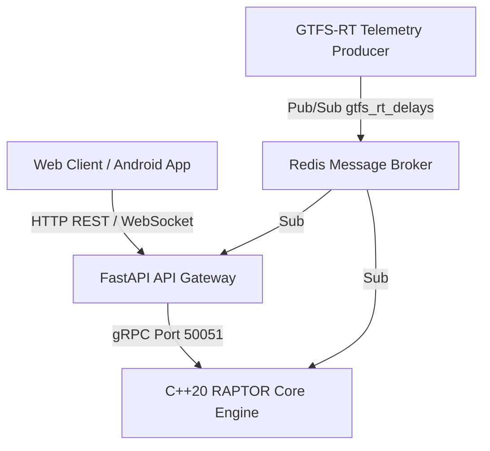

# TransitEngine

TransitEngine is a full-stack transit routing engine and real-time telemetry platform. It uses a custom C++20 implementation of the RAPTOR (Round-Based Public Transit Routing) algorithm to compute optimal transit journeys in under a millisecond, even across dense transit networks.

The project pairs this low-latency routing core with live GTFS-RT delay ingestion, a FastAPI gateway, an interactive web map, and a native Android application. Rather than relying on heavy graph-search algorithms like Dijkstra over large time-expanded networks, TransitEngine organizes timetable data into contiguous memory arrays and runs round-based sweeps to return Pareto-optimal itineraries (balancing travel time and transfer count) with live vehicle updates.

---

## Architecture Overview

TransitEngine is organized into decoupled services:



1. **C++20 RAPTOR Core Engine**: Runs as a gRPC service on port 50051. It loads binary-compiled GTFS data directly into memory and calculates departure rounds at sub-millisecond latencies.
2. **Telemetry Ingestion Layer**: Ingests live GTFS-RT updates and broadcasts trip delays through Redis Pub/Sub.
3. **FastAPI Gateway**: Connects web and mobile clients to the C++ core over gRPC, while offering an embedded Python RAPTOR fallback for standalone deployments. It also manages WebSocket connections to broadcast live bus positions to clients.
4. **Interactive Web Client**: A single-page map interface built with modern vanilla JavaScript and Leaflet, displaying real-time bus locations, stop timetables, and multi-leg trip itineraries.
5. **Android Client**: A native mobile app built with Kotlin, Jetpack Compose, and Material 3.

---

## How It Works

### High-Performance RAPTOR Routing
- **Round-Based Navigation**: Instead of constructing massive time-expanded graphs, RAPTOR operates directly on transit routes and trips in rounds (round k finds optimal journeys with at most k - 1 transfers).
- **Pareto Optimality**: Simultaneously minimizes total journey time and the number of transfers so users get practical, efficient routes.
- **Cache-Conscious Data Layout**: Routes, trips, and stop times are organized into contiguous Compressed Sparse Row (CSR) arrays to maximize CPU cache locality during sweep passes.
- **Binary GTFS Ingestion**: Raw GTFS feeds are compiled ahead of time into compact binary files (`stops.bin`, `stop_times.bin`, `routes.bin`, `trips.bin`, `transfers.bin`), eliminating CSV parsing overhead on startup.

### Concurrent Real-Time Updates
- **Live Delay Application**: Dynamic delays received over Redis Pub/Sub update active trip schedules on the fly.
- **Thread-Safe Synchronization**: Uses `std::shared_mutex` so background telemetry writes do not block concurrent route queries running across worker threads.

### API Gateway and Live Telemetry
- **Flexible Route Planning**: Returns multiple departure choices with walking legs, in-seat transfers (stay-on-board block chaining), intermediate stop lists, and shape-accurate route polylines.
- **Live Vehicle Positions**: Background workers compute real-time vehicle interpolations and stream snapshots to connected clients over WebSockets.
- **Stop Search and Schedules**: Instant stop lookups with autocomplete, radius search, and live departure boards with delay tags.

---

## Project Structure

```text
transit-engine/
├── core/                   # C++20 RAPTOR routing engine & gRPC server
│   ├── include/            # C++ headers (raptor_graph, raptor_router, etc.)
│   ├── src/                # Implementation files & telemetry consumer
│   ├── proto/              # Protocol buffer definitions (routing.proto)
│   └── CMakeLists.txt      # CMake build configuration
├── gateway/                # FastAPI async gateway & WebSocket server
│   ├── main.py             # App entry point, REST routes & WebSocket manager
│   ├── gtfs_data.py        # GTFS data parsing and live vehicle tracking
│   ├── raptor_engine.py    # Embedded Python RAPTOR implementation
│   └── routing_pb2*.py     # Generated gRPC client bindings
├── telemetry/              # GTFS-RT streaming & feed utilities
│   ├── live_stream.py      # Live telemetry producer publishing to Redis
│   └── gtfs_compiler.py    # Raw CSV GTFS to binary format compiler
├── web/                    # Web frontend
│   ├── index.html          # Interactive map interface
│   ├── app.js              # State management, routing UI & WebSocket handler
│   ├── styles.css          # Design system & responsive styling
│   └── sw.js               # Service worker for offline asset caching
├── client_android/         # Native Android application (Jetpack Compose)
├── infra/                  # Docker Compose and container setup
│   ├── docker-compose.yml  # Multi-service stack definition
│   ├── Dockerfile.cpp      # C++20 core engine container
│   ├── Dockerfile.gateway  # FastAPI gateway container
│   └── Dockerfile.python   # Telemetry worker container
├── raw_gtfs/               # Source GTFS CSV files
└── binary_gtfs/            # Compiled binary GTFS assets
```

---

## Quickstart with Docker Compose

The fastest way to get the entire stack running locally is with Docker Compose.

### Prerequisites
- Docker and Docker Compose installed on your system.

### Running the Services

```bash
# Clone the repository
git clone https://github.com/your-username/transit-engine.git
cd transit-engine/infra

# Build and start all containers (Redis, C++ Engine, Gateway, Telemetry)
docker compose up --build -d
```

Open the web interface in your browser:
```text
http://localhost:8000
```

To stop all services:
```bash
docker compose down
```

---

## Local Development (Running Services Directly)

If you want to run the individual services locally during development:

### 1. Start Redis
```bash
redis-server
```

### 2. Build and Run the C++ Core Engine
```bash
cd core
mkdir build && cd build
cmake .. -DCMAKE_BUILD_TYPE=Release
cmake --build . --config Release

# Start the gRPC routing engine on port 50051
./transit_engine
```

### 3. Start the FastAPI Gateway
```bash
# From the project root
pip install -r requirements.txt
python -m uvicorn gateway.main:app --host 0.0.0.0 --port 8000 --reload
```

### 4. Start the Telemetry Producer (Optional)
```bash
python telemetry/live_stream.py
```

---

## API Reference

### REST Endpoints

| Method | Endpoint | Description |
| :--- | :--- | :--- |
| `GET` | `/api/health` | Health check, indexed stop and route counts, active connections |
| `GET` | `/api/stops` | List all stops or search with query parameter `?q=name` |
| `GET` | `/api/stops/{id}` | Retrieve details for a specific transit stop |
| `GET` | `/api/stops/{id}/departures` | Fetch upcoming departures with live delay offsets |
| `GET` | `/api/nearest-stop` | Find the nearest transit stop given `lat` and `lon` |
| `GET` | `/api/routes` | List all available transit routes and metadata |
| `POST` | `/api/route` | Plan a journey between two stops (see payload format below) |

#### Sample Route Planning Request:
```json
POST /api/route
Content-Type: application/json

{
  "source_stop": 1024,
  "target_stop": 2048,
  "departure_time": "14:30:00",
  "num_options": 3
}
```

### WebSocket Stream

Connect to `/ws/live` to receive real-time fleet snapshots and vehicle positions:
```json
{
  "type": "VEHICLE_POSITIONS",
  "timestamp": 1719842400.12,
  "vehicles": [
    {
      "trip_id": "1449021",
      "route_id": "3M",
      "lat": 48.4284,
      "lon": -89.2642,
      "bearing": 182.5,
      "speed_kmh": 34.2,
      "delay_sec": 120
    }
  ]
}
```

---

## Performance Benchmarks

Tested on a representative municipal network (Thunder Bay Transit dataset):

| Metric | Result |
| :--- | :--- |
| **Indexed Stops** | 729 stops |
| **Indexed Stop Times** | 161,504 binary records |
| **Average Query Time (C++ RAPTOR)** | 0.4 ms to 0.8 ms |
| **Average Query Time (Python Fallback)** | 8.0 ms to 15.0 ms |
| **Telemetry Ingestion Throughput** | Over 10,000 delay updates / second |
| **WebSocket Broadcast Latency** | Under 5 ms |

---

## Deployment

For cloud hosting instructions (including configuration examples for Render, Railway, and Fly.io), see the [Deployment Guide](./DEPLOYMENT_GUIDE.md).

---

## License

This project is licensed under the MIT License. See the [LICENSE](LICENSE) file for details.
